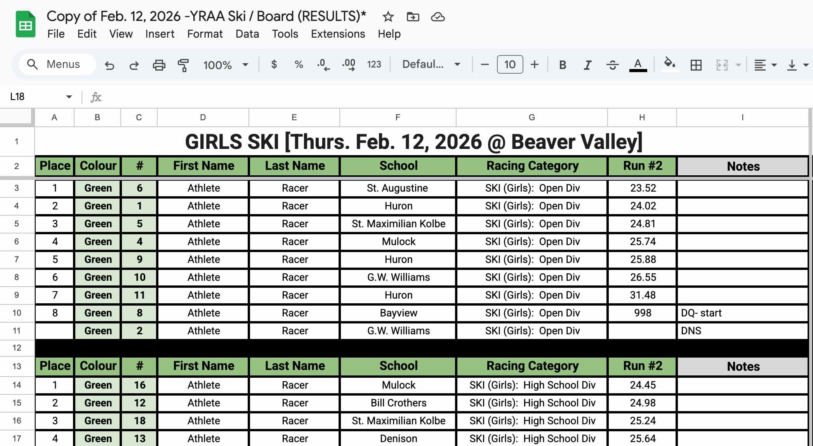

# YRAA Alpine Ski & Snowboard Championship Scoring

A scoring engine and web dashboard for the YRAA Alpine Ski & Snowboard Team Championships. Ingests raw race result CSVs, calculates championship points from place finishes, stores everything in SQLite, and serves team and individual leaderboards via a read-only web dashboard.

Implements scoring logic from the [YRAA Alpine Skiing Playing Regulations](http://yraa.com/documents/playingregs/AlpineSkiingRegs.pdf), sections 4.c–d.

## Quick Start

### Prerequisites

- Python 3.9+
- pip

### Install dependencies

```
pip install -r requirements.txt
```

### Ingest race results

Place raw race result CSVs in `data/raw/`, then ingest:

```
# Ingest all CSVs in a directory
python3 -m yraa.ingest --dir data/raw/

# Ingest a single file
python3 -m yraa.ingest --file data/raw/20260212-1-boys_ski_results.csv

# Skip confirmation prompt
python3 -m yraa.ingest --dir data/raw/ --yes

# Use a custom database path
python3 -m yraa.ingest --dir data/raw/ --db /path/to/yraa.db
```

The ingest command will show a preview of what will be imported (result counts, top scorers, race numbers) and prompt for confirmation before writing to the database.

Race numbers are assigned sequentially as files are ingested — the number in the filename (e.g., `-1-` or `-2-`) is for human reference only.

### Start the web dashboard

```
uvicorn yraa.web:app --host 0.0.0.0 --port 8000
```

Set `YRAA_DB_PATH` to change the database location (default: `data/yraa.db`).

### Legacy CLI

The original CLI for pre-computed championship point CSVs still works:

```
python3 -m yraa.cli --input data/samples/sample_legacy_cli.csv
```

## Docker Deployment

Build and run with Docker Compose. The compose file is configured for Traefik reverse proxy at `yraa.davecheng.com`.

```
docker compose up -d
```

Ingest data from within the container:

```
docker exec yraa python3 -m yraa.ingest --dir /app/data/raw/
```

The `data/` directory is volume-mounted, so place raw CSVs in `data/raw/` on the host and they'll be available inside the container. The SQLite database is stored at `data/yraa.db`.

## Scoring Rules

### Points Tables

**High School Division** — top 30 score points:

| Place | Pts | Place | Pts | Place | Pts | Place | Pts | Place | Pts |
|-------|-----|-------|-----|-------|-----|-------|-----|-------|-----|
| 1st | 50 | 7th | 26 | 13th | 18 | 19th | 12 | 25th | 6 |
| 2nd | 40 | 8th | 24 | 14th | 17 | 20th | 11 | 26th | 5 |
| 3rd | 35 | 9th | 22 | 15th | 16 | 21st | 10 | 27th | 4 |
| 4th | 32 | 10th | 21 | 16th | 15 | 22nd | 9 | 28th | 3 |
| 5th | 30 | 11th | 20 | 17th | 14 | 23rd | 8 | 29th | 2 |
| 6th | 28 | 12th | 19 | 18th | 13 | 24th | 7 | 30th | 1 |

**Open Division** — top 15 score points:

| Place | Pts | Place | Pts | Place | Pts | Place | Pts | Place | Pts |
|-------|-----|-------|-----|-------|-----|-------|-----|-------|-----|
| 1st | 25 | 4th | 16 | 7th | 10 | 10th | 6 | 13th | 3 |
| 2nd | 20 | 5th | 14 | 8th | 8 | 11th | 5 | 14th | 2 |
| 3rd | 18 | 6th | 12 | 9th | 7 | 12th | 4 | 15th | 1 |

### Team Scoring (Regulation 4.d.ii)

For each team (school), within each category (e.g., Girls Ski):

1. Best 12 scores from eligible racers are used
2. Scores from either division (HS or Open) are combined
3. Maximum 4 scores per racer
4. Zero scores only counted if the racer has at least one non-zero score
5. Teams ranked by total points descending; ties share the same rank

### Individual Scoring

Per athlete within a gender/sport/division:

- Sum of top 3 race results if 5 or fewer races have occurred
- Sum of top 4 race results if 6 or more races have occurred
- The athlete detail dialog shows all race results; counting results are bolded

### Individual Tiebreakers (Regulation 4.d.i.h)

When two athletes have the same total points, ties are broken in order:

1. **Head-to-head**: Sum of points in races where both athletes competed; higher total wins
2. **Best single result**: Compare each athlete's best race result, then second-best, and so on until one is higher
3. **More races**: If all compared results are equal, the athlete with more races ranks higher
4. If still tied after all tiebreakers, athletes share the same rank (skip-on-tie numbering)

### Leaderboards

4 category pages (Girls Ski, Boys Ski, Girls Snowboard, Boys Snowboard), each with 3 tabs:

- **HS** — individual High School division standings
- **Open** — individual Open division standings
- **Team** — team standings (Open + HS combined)

A dedicated race results page shows all race results with filtering by category, division, race number, school, and athlete.

URL structure: `/{gender}/{sport}/{tab}` (e.g., `/girls/ski/hs`), `/races`

### CSV Export

Any leaderboard or race results view can be exported as CSV:

- **Individual championship** — `/export/{gender}/{sport}/{division}` (place, name, school, points)
- **Team championship** — `/export/{gender}/{sport}/team` (place, school, points)
- **Race results** — `/export/races` (respects active filters; includes race column when viewing multiple races)

Export links appear on each tab and on the race results page. Filenames are descriptive based on the active view and filters.

### DQ/DNF/DNS Handling

Athletes are flagged with a status (DQ, DNF, or DNS) based on:
- Notes column contains DNS, DNF, DQ, or DSQ as a substring (case-insensitive; priority: DNS > DNF > DQ; DSQ maps to DQ)
- Time ≥ 998 or empty place with no valid time defaults to DNF

Flagged athletes are stored in the database and displayed at the bottom of race result pages (blank place, status in time column, blank points). They are excluded from individual and team championship scoring.

## Raw CSV Format

Race results are recorded in a Google Sheets spreadsheet and exported as CSV for ingestion. The spreadsheet should follow this format:



The exported CSV follows this structure:

```
"BOYS SKI [Thurs. Feb. 12, 2026 @ Beaver Valley]",,,,,,,,
Place,Colour,#,First Name,Last Name,School,Racing Category,Run #1,Notes
1,Orange,7,Finley,Hankai,Denison,SKI (Boys):  Open Div,21.81,
...
[blank row]
Place,Colour,#,First Name,Last Name,School,Racing Category,Run #1,Notes
1,Orange,116,Thomas,OMeara,Cardinal Carter,SKI (Boys):  High School Div,24.66,
...
```

**Key formatting requirements:**

- **Row 1** — Title row: category and event info (e.g., `GIRLS SKI [Thurs. Feb. 12, 2026 @ Beaver Valley]`)
- **Row 2** — Header row: `Place, Colour, #, First Name, Last Name, School, Racing Category, Run #1, Notes`
- **Data rows** — One row per racer with place, bib info, name, school, racing category, and time
- **Division sections** — Open and High School divisions are separated by a blank row, each with its own header row (though the second header row is optional)
- **Racing Category** — Must contain the sport, gender, and division (e.g., `SKI (Girls):  Open Div`, `BOARD (Boys):  High School Div`)

Filename convention: `YYYYMMDD-N-gender_sport_results.csv` (e.g., `20260212-1-boys_ski_results.csv`). The date is extracted from the filename for the event record.

### Notes for Scorekeepers: DQ / DNF / DNS

When a racer does not finish or is disqualified, record it as follows:

| Situation | Place | Time | Notes |
|-----------|-------|------|-------|
| **Did Not Start (DNS)** | Leave blank | Leave blank | `DNS` |
| **Did Not Finish (DNF)** | Leave blank | Leave blank | `DNF` |
| **Disqualified (DQ)** | Leave blank | `998` | `DQ` followed by reason (e.g., `DQ- start`, `DQ- missed gate`) |

- The **Notes** column is what the system checks first. Write `DNS`, `DNF`, or `DQ` anywhere in the Notes field (case doesn't matter). `DSQ` is also recognized as DQ.
- A time of **998 or higher** with no Notes entry is treated as DNF.
- A **blank Place with no valid time** and no Notes entry is also treated as DNF.
- Flagged athletes are excluded from championship scoring but still appear in race results for record-keeping.

### Parsing Edge Cases

- Section order is not guaranteed (could be HS first, then Open)
- Second section header row may be missing (e.g., girls snowboard)
- Some categories may have no Open division (e.g., boys snowboard)
- Tied places get the same place number and same points
- Names with parenthetical nicknames kept as-is: "Alexander (Sasha)"
- Trailing whitespace on school names is stripped

## Project Structure

```
yraa/
    cli.py         — legacy CLI for pre-computed CSVs
    scoring.py     — team scoring algorithm (Regulation 4.d.ii)
    models.py      — data classes (RaceResult, TeamScore, ContributingScore)
    io.py          — legacy CSV parsing
    points.py      — place-to-points lookup tables
    parser.py      — raw race result CSV parser
    db.py          — SQLite schema, inserts, leaderboard queries
    ingest.py      — CLI for ingesting raw CSVs into the database
    web.py         — FastAPI web dashboard and CSV export endpoints
    templates/
        base.html      — base layout (Pico CSS, medal circle styles)
        home.html      — landing page with season summary
        category.html  — championship leaderboards (HS/Open/Team tabs)
        races.html     — race results with filtering and time display toggle

data/
    samples/
        sample_race_results.csv  — reference raw race CSV for ingest
        sample_legacy_cli.csv    — reference pre-computed points CSV for legacy CLI
    raw/           — raw race result CSVs from scorekeeper (gitignored)
    yraa.db        — SQLite database (generated, gitignored)
```

## Planned Features

- **Admin interface** — Authenticated web UI for uploading race result CSVs, replacing the CLI ingest workflow

## To Do

- **Remove legacy CLI and floating-point score support** — The legacy CLI (`cli.py`, `io.py`) and floating-point point handling exist to support older pre-computed spreadsheets where points were sometimes manually split (e.g., 20.5). The current ingest pipeline assigns integer points strictly from the regulations' place-to-points tables, making this unnecessary. Remove once the ingest pipeline is fully validated and the legacy CLI is no longer needed.
